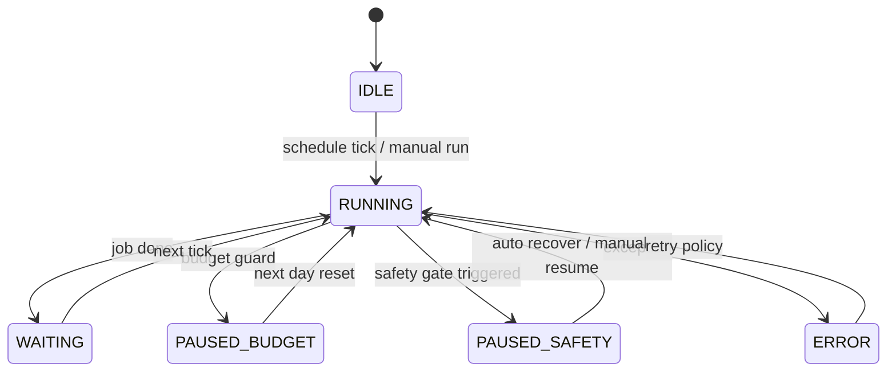

# x-aout-agent 概要（全体設計）

## 目的
X（Twitter）運用を「1アカウント=1エージェント」で完全自律化し、フォロワー増加を最上位目的として日次PDCAを回す。
複数エージェントが検証で得た高確度知見を共有し、全体最適を加速する。

## 重要な前提（確定）
- 予算：1アカ/日 300円（X=100 / LLM=200）※超過見込みの行動は禁止（ハードガード）
- 毎日必須：2日前投稿「全件」の確定メトリクス取得
- 追加メトリクス：実験投稿のみ・最大5回/投稿（スナップショット）
- 行動上限：リプ 最大3/日/アカ、引用RT 最大3/日/アカ（ハード上限）
- 検索：X検索 + Web検索（常時OK。ただし予算残高でガード）
- 週次：AIが weekly_focus_kpi を選定し、1週間はそのレバー中心にPDCA
- 必須ルール：`必須.md`（Xアルゴリズム理解 / AIっぽくない話し方）を全エージェントに強制適用

## コンポーネント
- Dashboard（Web UI / Next.js）
  - アカウント管理、オンボーディング、スケジュール、実験、共有ナレッジ、コスト/ログ、緊急停止
- Supervisor（API / FastAPI）
  - エージェント監視、共有ナレッジ管理、コスト監視、トグル/設定反映
- Worker（APScheduler + Agent runtime）
  - 日次PDCAジョブ実行、投稿生成/予約、エンゲージ、検索、メトリクス収集
- DB（Postgres）
  - 全エンティティとログを永続化

## 全体フロー（Mermaid）
```mermaid
flowchart TB
  UI[Dashboard (Web UI)] --> API[Supervisor API]
  API --> DB[(Postgres)]
  API --> W[Worker / Scheduler]

  subgraph Agents["Agents (1 account = 1 agent)"]
    A1[Agent: Account A]
    A2[Agent: Account B]
    A3[Agent: Account C]
  end

  W --> A1
  W --> A2
  W --> A3

  A1 --> DB
  A2 --> DB
  A3 --> DB

  A1 --> R1[必須.md + 共有ナレッジ]
  A2 --> R1
  A3 --> R1
```

エージェント日次PDCA（概要）

起動（定時）

2日前投稿全件を取得 → 確定メトリクス取得（必須）

必要ならスナップショット（実験投稿のみ・最大5回/投稿）

分析（伸び/失速要因、週次focusとの整合）

知見をローカル記憶へ保存、確度が高いものは共有ナレッジへ昇格

翌日の投稿計画策定 → 生成 → 予約

競合ターゲットへエンゲージ（上限内）

コストログ更新 → 待機

共有ナレッジ昇格

AIが「確度が高い・重要」と判断した知見を、検証過程・結果と共に昇格

重要：証拠タイプをラベル（例：snapshot / confirmed / mixed）

信頼度：検証回数×効果量（簡易でOK）

ログと再現性（最小要件）

日次の意思決定は JSON で残す（理由・根拠・コストを含む）

週次focusの選定理由もログに残す（なぜそのレバーか）

状態遷移（Worker）


ディレクトリ方針（推奨）

- apps/api: Supervisor API
- apps/worker: Scheduler + Agent runtime
- apps/web: Dashboard
- packages/core: DB models / domain logic / interfaces
