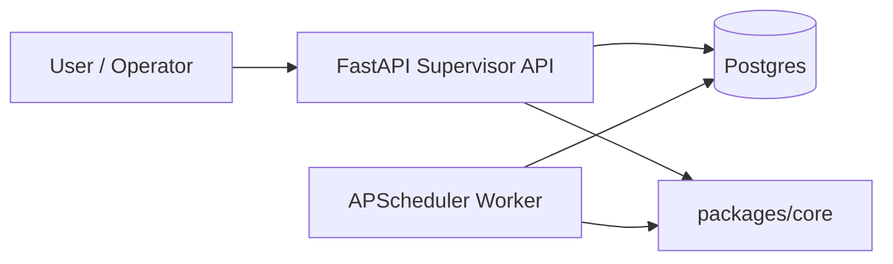

# Overview

x-aout-agent は、API で制御し worker が定期実行するエージェント基盤です。

## コンポーネント

- API (`apps/api`): Supervisor と外部I/Fを担当
- Worker (`apps/worker`): スケジュール実行とジョブ実行
- Core (`packages/core`): 共有モデル・I/F
- Postgres: 状態保存

## Mermaid 図

